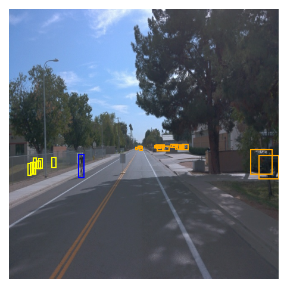
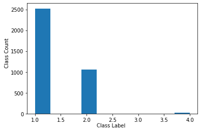
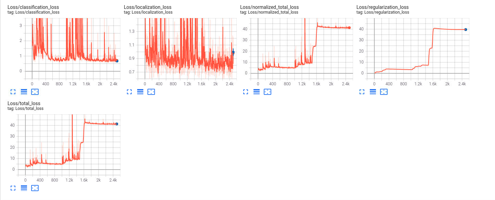
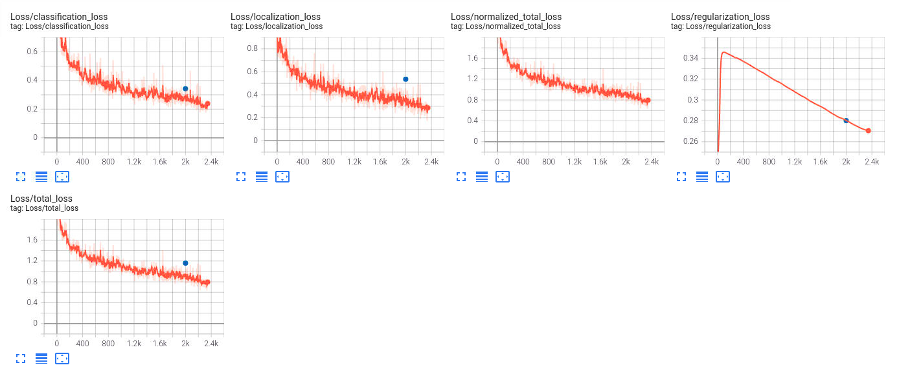
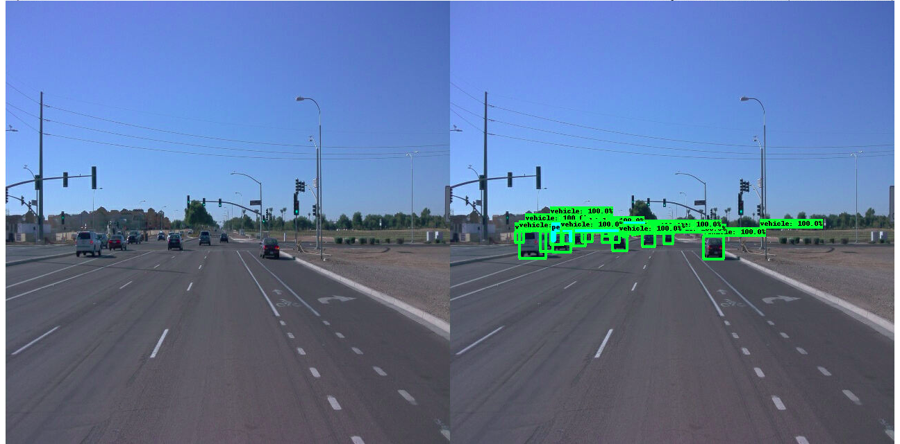

# Object Detection in an Urban Environment


## Project overview
Object detection in an urban environment is a challenging task for self-driving cars, 
as the cars must classify multiple objects in their field of view with high precision. 
This repository uses the Tensorflow object recognition API to identify cars, pedestrians, and cyclists based 
on training data of the Waymo dataset.

The workflow of the project is structured in the following way:
- Analysis of the Waymo dataset 
- Testing performance of a pretrained model 
- Analysing shortcoming of the pretrained model and implement improvements 
- Training the improved model 


## Set up
For local setup if you have your own Nvidia GPU, you can use the provided Dockerfile and requirements in the [build directory](./build).

Follow [the README therein](./build/README.md) to create a docker container and install all prerequisites.


### Training

To launch an experiment with the Tensorflow object detection API use:
```
python experiments/model_main_tf2.py --model_dir=experiments/reference/ --pipeline_config_path=experiments/reference/pipeline_new.config
```
Once the training is finished, launch the evaluation process:
* an evaluation process:
```
python experiments/model_main_tf2.py --model_dir=experiments/reference/ --pipeline_config_path=experiments/reference/pipeline_new.config --checkpoint_dir=experiments/reference/
```

**Note**: Both processes will display some Tensorflow warnings, which can be ignored. You may have to kill the evaluation script manually using
`CTRL+C`.

To monitor the training, you can launch a tensorboard instance by running `python -m tensorboard.main --logdir experiments/reference/`. You will report your findings in the writeup.

## Dataset

For this project, we will be using data from the [Waymo Open dataset](https://waymo.com/open/).

The data used for training, validation and testing is organized as follow:
```
/home/workspace/data/
- train: contain the train data 
- val: contain the val data 
- test - contains files to test the model and create inference videos
```

### Dataset analysis

The waymo dataset consists of a set of images of road traffic captured by cameras on a self-driving car. The three objects of interest in these images are vehicles, pedestrians, and cyclists, which are labeled using ground truth boxes for each image. The images themselves differ in many ways: different numbers of classes to be detected, different colors of classes to be detected, different lighting conditions, and different weather conditions.

The following image is an example of an image used for training, with ground truth added in the form of boxes:



We can further explore the dataset quantitatively by starting with the distribution of classes to be recognized in any subset of the dataset. The class for cars (1) is the most common, followed by pedestrians (2) and cyclists (3). This lack of sampling with bicyclists could affect the performance of the algorithm in correctly detecting bicyclists later.




### Cross validation
A total of 100 tfrecord instances are used to train, test and validate the algorithm. 

The split used is the following: 70% training, 20% validation and 10% testing. The fact that unique subsets are used for these steps prevents overfitting. 

Finally, the data is randomly shuffled to minimize structural imbalances in the data set.

## Training
### Reference experiment
As an initial experiment, the performance of the pretrained 

was investigated. 

Data Augmentation options are:

```
random_horizontal_flip {}
```

and

```
    random_crop_image {
      min_object_covered: 0.0
      min_aspect_ratio: 0.75
      max_aspect_ratio: 3.0
      min_area: 0.75
      max_area: 1.0
      overlap_thresh: 0.0
    }
```

Optimizer settings are the following:
```
    momentum_optimizer {
      learning_rate {
        cosine_decay_learning_rate {
          learning_rate_base: 0.04
          total_steps: 2500
          warmup_learning_rate: 0.013333
          warmup_steps: 200
        }
      }
      momentum_optimizer_value: 0.9
    }
    use_moving_average: false
```

The initially set batch size is 2. 

Analyzing the training and validation loss of the reference model shows suboptimal performance. 
The loss curves are noisy and do not decrease much. In the following, 
the training loss is indicated in orange and the validation loss in blue.



### Improve on the reference
Multiple changes were necessary to improve the performance: 
- Increase the number of training epochs 
- Increase the batch size 
- Increase the number of warmup steps of the optimizer 

Furthermore, multiple new data augmentation options were introduced

- random_adjust_brightness
- random_adjust_contrast
- random_rgb_to_gray

with the goal of improving the generalizability of the model.
The details of this can be found in the  "Explore augmentations.ipynb" notebook.

Training and testing of the improved model is investigated in the following.



The loss curve are now more stable and reach lower final values compared to the unaugmented model. 
This indicates better performance.


Finally, an example of the trained model classifying an image:




